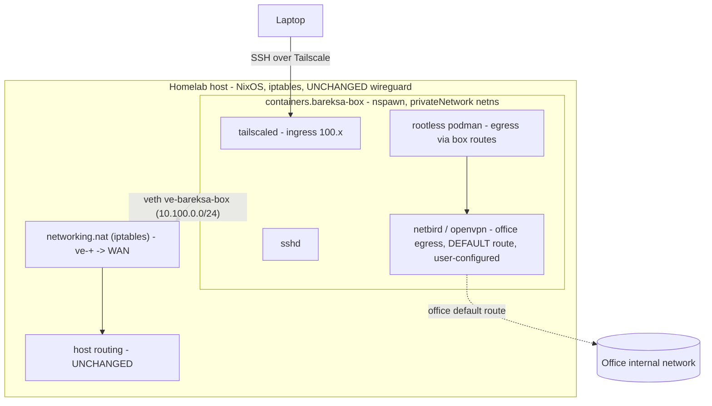

Mode-neutral spec (FASE 1). Any executor ingests this unmodified.

<Aside type="note" title="Pivot: Incus → systemd-nspawn">
This spec originally targeted Incus. The NixOS `virtualisation.incus` module has a
hard `assertion` requiring `networking.nftables.enable = true` whenever the host
firewall is on ("Incus on NixOS is unsupported using iptables"). This host runs
iptables, and `services/wireguard.nix` uses **raw `iptables`** (FORWARD + nat
MASQUERADE) — flipping the backend would force porting + re-testing wireguard
(remote-access risk). systemd-nspawn has no such requirement, is native NixOS, and
covers every hard requirement, so the scope pivoted to it. Incus rejected;
rationale kept in Decisions.
</Aside>

## Goal

Run the office VPN (netbird + OpenVPN) on the homelab **without touching host
routing**, in an isolated container the user can SSH into and run programs in.
Podman workloads inside egress through the office VPN. Not a VM (shared kernel, no
static reservation). Adding packages to the box = edit the host flake + rebuild
(**one door**).

## Verifiable done-condition

1. `containers.bareksa-box` (systemd-nspawn) is up, `autoStart`, guest = NixOS.
2. User can **SSH directly into bareksa-box over Tailscale** (box is its own
   tailnet node) from a laptop.
3. From inside the box, after the user **manually** brings the office VPN up,
   traffic reaches the **office internal network** (an internal host NOT reachable
   from the homelab host).
4. **Host routing stays clean** — `ip route` / `traceroute` on the host is
   unchanged; only the box netns carries the office default route. Host firewall
   stays **iptables** (no nftables flip); wireguard untouched.
5. Rootless podman runs inside the box (nesting), egress via the box routes.

Acceptance is **observed behavior**, not tests-pass: `machinectl`/`nixos-container`
shows the box running, SSH in over tailnet, bring VPN up, hit an internal target;
confirm host `traceroute` differs from box `traceroute`.

## Scope

In scope — **we build the box + tooling, reachable and ready**:

- Host module `services/bareksa-box.nix`, imported in `services/default.nix`:
  - `containers.bareksa-box`:
    - `autoStart = true;`
    - `privateNetwork = true;` + `hostAddress`/`localAddress` on a fresh
      **`10.100.0.0/24`** (avoid wireguard `10.0.0.0/24` + tailnet `100.64/10`).
    - `enableTun = true;` (VPN needs `/dev/net/tun`).
    - `additionalCapabilities` for VPN route setup: `CAP_NET_ADMIN`
      (+ `CAP_NET_RAW` if OpenVPN needs it) — validate live.
    - Nesting so rootless podman runs inside — the exact knob (nspawn
      `SystemCallFilter`/userns/`enableNesting`-equivalent) is a **validate-live**
      item; document what worked.
    - `config = { ... }:` = the **guest NixOS** (see below).
  - Host NAT for container egress (mirror the wireguard NAT pattern, stay
    iptables): `networking.nat` with `internalInterfaces = [ "ve-+" ]`
    (the veth) + the WAN `externalInterface`; forwarding enabled.
  - `networking.firewall.trustedInterfaces += [ "ve-+" ]` so host doesn't drop
    container traffic (mirror tailscale0/wg0).
  - **cgroup containment** on the container's systemd unit
    (`container@bareksa-box.service` / a dedicated slice): `CPUWeight`
    coding-tier-equivalent (100) + soft `MemoryHigh` (~8G, `TODO(tune)`), no hard
    `MemoryMax` (SPEC containment section).
- Guest NixOS (`containers.bareksa-box.config`) — **lives in the host flake**:
  - `services.tailscale.enable = true;` (own tailnet node, SSH ingress).
  - `services.openssh.enable = true;` (sshd).
  - `environment.systemPackages = [ netbird openvpn ];` (**packages present,
    unconfigured** — user supplies creds manually). Optionally
    `services.netbird.enable` left off until user configures.
  - `virtualisation.podman.enable = true;` rootless-friendly.
  - a user account for SSH (matches the operator).
- Telemetry wiring (see Telemetry).
- Docs: this spec; a design doc if the nspawn-VPN pattern outlives the box.

Non-goals (**out of scope**):

- **VPN credentials / config.** User configures netbird (setup key) + OpenVPN
  (`.ovpn`) **manually after first entry** — "terlalu sensitif". No sops secret.
  No pre-seeded tailscale auth key (bootstrap via `nixos-container root-login`
  / `machinectl shell`).
- Incus / LXC / any extra container daemon (nspawn is systemd-native).
- nftables host firewall migration (the whole reason for the pivot).
- Multi-container / general container-host use — just this one box.

## Architecture

Two VPNs in one netns coexist: Tailscale owns its `100.64.0.0/10` routes (ingress
mgmt, no default needed); the office VPN takes the **default** route (egress).
Bootstrap: `nixos-container root-login bareksa-box` (or `machinectl shell`) →
`tailscale up` (interactive auth) → SSH via Tailscale works → configure office VPN.

## Decisions

<Decision title="systemd-nspawn, not Incus (nftables assertion)">
NixOS `virtualisation.incus` asserts `networking.nftables.enable = true` whenever
the firewall is on. Host is iptables + `wireguard.nix` uses raw `iptables` →
flipping forces wireguard porting + remote-access risk. nspawn has no such
requirement, is native (no extra daemon), and its NixOS wrapper puts guest config
**in the host flake** (one-door for free). **Chosen:** nspawn. **Rejected:** Incus
(+nftables flip), unmanaged incusd (hacky), Debian+bind-mount store (GC-fragile).
</Decision>

<Decision title="Guest config in host flake (one-door)">
`containers.bareksa-box.config` is a full NixOS module in the host flake. Adding a
package = edit that block + `nixos-rebuild switch` on the host. This is the
"one-door via NixOS" the user asked for — nspawn gives it inherently (no separate
guest flake to manage). Trade-off: the box is **declarative, not a hand-mutable
pet** — persistent changes go through host rebuild (SSH-in for runtime/interactive
work is still fine). Accepted; the user's goal already leans declarative.
</Decision>

<Decision title="Keep host on iptables">
No `networking.nftables.enable`. Container egress NAT reuses the existing
`networking.nat` (iptables) pattern from wireguard.nix. Zero firewall blast
radius; wireguard untouched.
</Decision>

<Decision title="Private subnet 10.100.0.0/24">
`privateNetwork` veth uses `10.100.0.0/24` to avoid collision with wireguard
`10.0.0.0/24` and tailnet `100.64.0.0/10`.
</Decision>

## CPU / memory containment (homelab CPU-priority integration)

<Aside type="caution" title="nspawn container lands in machine.slice / system.slice">
An nspawn container runs under `container@bareksa-box.service` (system-level, root),
so like Incus it sits **outside `user.slice`** — bypassing the `user.slice
CPUQuota=680%` ceiling and the coding/batch `CPUWeight` tiers, and the media-batch
oomd/`MemoryHigh` policy. Left alone it competes for CPU/RAM **unbounded** vs
jellyfin + coding sessions.
</Aside>

Containment (ceilings/weights — NOT static reservation):

- Put `container@bareksa-box.service` in a dedicated slice (e.g. `bareksa.slice`)
  with `CPUWeight` at coding-tier-equivalent (100; interactive=200, batch=10 per
  `cpu-priority`). Background egress box → coding-equivalent, revisit.
- Soft `MemoryHigh` (~8G, `TODO(tune)`) so a runaway VPN/podman workload reclaims
  before swap-thrashing the host (mirrors `memory-budget.nix` batch policy). No
  hard `MemoryMax` initially.
- No disk reservation (nspawn rootfs lives on host btrfs, grows as used).

## Telemetry

Infra-level only — no app code, no request path.

- **Traces:** N/A — no logical request/operation to trace (a VPN egress
  container). Intentionally none.
- **Logs (existing Loki via Alloy):** **nspawn forwards guest journald to the host
  journal automatically** (`journalctl -M bareksa-box` / `_MACHINE_ID`). The host
  Alloy already ships the host journal to Loki → guest logs arrive for free. Verify
  the Alloy `loki.source.journal` config keeps the machine/container field as a
  low-cardinality label (`container="bareksa-box"` or `_SYSTEMD_UNIT`). Severity
  from journald priority.
- **Metrics (existing Prometheus — Alloy push, NOT scrape_configs):** this repo's
  Prometheus is fed by **Alloy `prometheus.scrape` blocks → `prometheus.remote_write`**
  (`services/observability.nix`), not classic `scrape_configs`. Container resource
  (cpu/mem/io) is available from the cgroup — expose via the existing node/cgroup
  path (`below.nix` already monitors cgroups; if a Prometheus series is wanted, add
  an Alloy `prometheus.scrape "bareksa"` block mirroring the existing `host` block,
  sourcing cgroup/cadvisor-style metrics). Counters/gauges only — **no custom
  histograms**, no bucket tuning.
  - **Optional / follow-up (after user configures VPN):** a
    `bareksa_vpn_tunnel_up{provider="netbird|openvpn"}` gauge via a
    node_exporter textfile-collector script in the guest. Deferred (VPN is
    user-managed); not part of initial acceptance.
- **Acceptance:** Loki shows guest journald filtered by `container="bareksa-box"`;
  Grafana shows the box's cgroup CPU/mem.

### Sensitive data

- **Tier A (always redact):** VPN key material — netbird setup key, OpenVPN
  certs/keys, tailscale auth key. **Not in our scope** (user-configured); log
  shipping must never ingest secret files; VPN unit logs must not echo keys
  (they don't by default) — verify at wiring time.
- **Tier B (account handles):** none — single operator, no app users.
- **Tier C (KYC PII):** none.
- **Tier D (ask) — IP addresses:** office internal IPs, tailnet `100.x`, VPN peer
  endpoints appear in logs + net metrics. **Decision: keep visible (option a, full
  value)** — single-operator private homelab, no third-party PII, IP is the primary
  VPN/routing debug signal. No company policy applies.
- **Committed project rule:** none needed yet (no app instrumentation code).
  Revisit if the optional VPN exporter lands.

### Cardinality

- Log labels bounded (`container`, `unit`, `level`) → safe.
- cgroup metric labels bounded (one container) → safe.
- Watch: a future netbird per-peer exporter (`peer_id`) is unbounded → keep
  per-peer off metrics (logs only). Not in initial scope.

## Risks / open questions

<Aside type="danger" title="Bootstrap chicken-and-egg (Tailscale)">
SSH-via-Tailscale is the done-state, but Tailscale must be authed first and you
can't SSH in to do it. **Bootstrap:** `sudo nixos-container root-login bareksa-box`
(or `sudo machinectl shell bareksa-box`) → `tailscale up` (interactive auth URL)
from the host → tailnet node joins → SSH works. No stored auth key.
</Aside>

- **Nested rootless podman in nspawn:** userns + cgroup delegation must be
  validated; may need extra nspawn settings (`SystemCallFilter`,
  `PrivateUsers`/`--private-users`, cgroup delegation) and possibly
  `fuse-overlayfs` + `/dev/fuse` if native overlay is refused. Validate live,
  document what worked. Fallback: rootful podman inside if rootless fights nspawn.
- **TUN + caps:** `enableTun` + `CAP_NET_ADMIN` must let netbird/openvpn create
  tun + routes; netbird may fall back to userspace wireguard-go if kernel wg is
  blocked in the container. Validate.
- **NAT for privateNetwork veth:** confirm `networking.nat.internalInterfaces =
  [ "ve-+" ]` + forwarding gives the container WAN egress on iptables without
  extra raw rules; if a FORWARD accept is needed, prefer
  `networking.firewall.extraCommands` (iptables, consistent with wireguard) —
  scoped, not a backend change.
- **cgroup slice values:** exact `CPUWeight` / `MemoryHigh` are tuning calls —
  start coding-tier-equivalent, observe via below/Grafana, revisit.

## Decomposition

One coherent change: host `containers.bareksa-box` module (incl. guest config) +
NAT/firewall wiring + cgroup containment + telemetry verification. Single slice,
**attended** (user present to root-login, auth tailscale, test office
reachability). No low-tolerance surface in **our** scope (VPN creds user-managed,
out of scope; no firewall flip; wireguard untouched).
