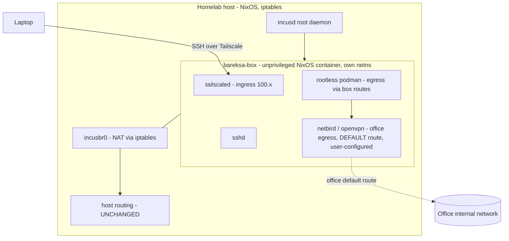

Mode-neutral spec (FASE 1). Any executor ingests this unmodified.

## Goal

Run the office VPN (netbird + OpenVPN) on the homelab **without touching host
routing**, in an isolated container the user can SSH into and run programs in
(stateful pet, not a stateless app-container). Podman workloads inside egress
through the office VPN. No static resource reservation (not a VM).

## Verifiable done-condition

1. `bareksa-box` is up as an **unprivileged Incus system container** (guest =
   NixOS), auto-started on host boot.
2. User can **SSH directly into `bareksa-box` over Tailscale** (the box is its
   own tailnet node) from a laptop.
3. From inside the box, after the user **manually** brings the office VPN up,
   traffic reaches the **office internal network** (ping/ssh/curl an internal
   host that is NOT reachable from the homelab host).
4. **Host routing stays clean** — `ip route` / `traceroute` on the homelab host
   is unchanged; only the box's netns carries the office default route.
5. Rootless podman runs inside the box (nesting), its containers egress via the
   box's routes (i.e. through the office VPN once up).

Acceptance is **observed behavior**, not tests-pass: attach, bring VPN up, hit an
internal target; confirm host `traceroute` differs from box `traceroute`.

## Scope

In scope — **we build the box + tooling, reachable and ready**:

- Host module `services/bareksa-box.nix` (or `modules/incus.nix` + service):
  - `virtualisation.incus.enable` (root daemon), subuid/subgid mapping.
  - Storage pool on **btrfs** (root FS is btrfs — cheap snapshots) or `dir`.
  - Bridge `incusbr0` + NAT egress via the **existing iptables** path (no
    firewall-backend flip — see Decision).
  - `net.ipv4.ip_forward` sysctl; `trustedInterfaces += incusbr0`.
  - **cgroup containment** so the container obeys homelab CPU-priority design
    (it lands in `system.slice`, escaping `user.slice` — see Decision).
  - `/dev/net/tun` passthrough + `security.nesting=true` on the instance.
- Guest NixOS config (**level-1: guest owns its own flake**), installed once:
  - `tailscale` (own tailnet node, ingress mgmt) + `openssh` (sshd).
  - `netbird` + `openvpn` client **packages present** (services enabled but
    unconfigured — user supplies creds manually).
  - `podman` rootless (`virtualisation.podman`, nesting-friendly).
- Telemetry wiring (see Telemetry) — incus metrics scrape + guest log shipping.
- Docs: this spec + a design doc if the pattern outlives the box.

Non-goals (**out of scope**):

- **VPN credentials / config.** User sets up netbird (setup key) + OpenVPN
  (`.ovpn`) **manually after first SSH** — "terlalu sensitif". No sops secret for
  VPN creds. No pre-seeded tailscale auth key (bootstrap via `incus exec`).
- Host firewall backend migration to nftables (explicitly rejected below).
- Level-2 host-flake closure-push (future upgrade, not now).
- Multi-container / general Incus host use — just this one box.

## Architecture

Two VPNs in one netns coexist: Tailscale owns its `100.64.0.0/10` routes
(ingress mgmt, no default route needed); the office VPN takes the **default**
route (egress). Bootstrap order: `incus exec` console → `tailscale up` (interactive
auth) → SSH via Tailscale works → user configures office VPN.

## Decisions

<Decision title="Keep host on iptables — do NOT flip to nftables">
Host firewall is iptables today (`networking.firewall` + `networking.nat`, used
by wireguard.nix). `networking.nftables.enable` would rewrite the entire host
firewall (`nixos-fw`) — broad blast radius across every existing service. Incus
can drive its bridge via the **xtables (iptables)** firewall driver, so the flip
is unnecessary. **Chosen:** iptables + Incus xtables driver. **Rejected:**
nftables flip (risk not justified for one container).
</Decision>

<Decision title="Guest = NixOS, level-1 (own flake)">
Guest runs NixOS with its **own flake**; packages added via `nixos-rebuild switch`
inside the box (one door *per guest*). **Chosen** over level-2 (host-flake closure
push) for speed-to-working; level-2 is a later upgrade. **Rejected:** Debian +
`nix` bind-mount of host store (GC-fragile, uid-shift pain, not one-door-clean).
</Decision>

<Decision title="Unprivileged container under root daemon — not rootless Incus">
Rootless Incus (daemon as non-root) makes bridge/NAT/TUN need root anyway and
worsens nested-podman userns (double nesting → subuid exhaustion, overlay errors).
**Chosen:** root daemon + **unprivileged** container (guest root is uid-mapped,
no real host root). Security win without hurting podman.
</Decision>

<Decision title="Storage pool = btrfs subvolume">
Root FS is btrfs → an Incus `btrfs` pool gives cheap snapshots + thin growth (no
preallocation). **Chosen** over `dir` (works but no snapshots). Fallback `dir` if
btrfs pool setup fights the disko layout.
</Decision>

## CPU / memory containment (homelab CPU-priority integration)

<Aside type="caution" title="Incus escapes user.slice by default">
`incusd` runs as root → its containers land in **`system.slice`**, bypassing the
`user.slice CPUQuota=680%` ceiling and the coding/batch `CPUWeight` tiers
(`modules/cpu-priority` rules), and the media-batch oomd/`MemoryHigh` policy. Left
alone, `bareksa-box` competes for CPU/RAM **unbounded** against jellyfin + coding
sessions.
</Aside>

Containment (ceilings/weights — NOT static reservation):

- Put `incusd` (or the instance's cgroup) in a dedicated slice with a `CPUWeight`
  set relative to the existing tiers (interactive 200 / coding 100 / batch 10).
  bareksa-box is a background egress box → treat like **batch/coding tier**
  (proposal: coding-equivalent weight, revisit).
- `MemoryHigh` (soft) on that slice so a runaway VPN/podman workload reclaims
  before swap-thrashing the host (mirrors `memory-budget.nix` batch policy). No
  hard `MemoryMax` initially.
- Optionally `limits.cpu.allowance` / `limits.memory` on the instance itself
  (cgroup cap, still not a VM-style reserve). `dir`/btrfs = no disk reserve.

## Telemetry

Infra-level only — no app code, no request path.

- **Traces:** N/A. There is no logical request/operation to trace (a VPN egress
  container). Documented as intentionally none.
- **Metrics (existing Prometheus):**
  - Scrape the **Incus metrics endpoint** (`core.metrics_address`, TLS or via a
    localhost bind scraped by the host Prometheus): `incus_cpu_seconds_total`,
    `incus_memory_*`, `incus_network_receive/transmit_bytes_total`,
    `incus_disk_*`, `incus_instances`. Counters/gauges — **no custom
    histograms**, so no bucket tuning needed.
  - Container resource also visible via existing `below.nix` cgroup monitor.
  - **Optional / follow-up (after user configures VPN):** a
    `bareksa_vpn_tunnel_up{provider="netbird|openvpn"}` gauge via a
    node_exporter textfile-collector script in the guest. Deferred because VPN
    is user-managed; not part of initial acceptance.
- **Logs (existing Loki via Alloy):** ship guest **journald** to host Loki
  (guest runs a lightweight Alloy/promtail over the bridge or tailnet). Labels:
  `host="bareksa-box"`, `unit`, `level` — all low-cardinality. Severity from
  journald priority. No trace correlation (no traces).
- **Acceptance:** Grafana shows `bareksa-box` CPU/mem/net from incus metrics;
  Loki shows guest journald filtered by `host="bareksa-box"`.

### Sensitive data

- **Tier A (always redact):** VPN key material — netbird setup key, OpenVPN
  certs/keys, tailscale auth key. **Not in our scope** (user-configured), and log
  shipping must never ingest the secret files. netbird/openvpn unit logs must not
  echo keys (they don't by default) — verify at wiring time.
- **Tier B (account handles):** none — single operator, no app users, no login
  handles.
- **Tier C (KYC PII):** none.
- **Tier D (ask) — IP addresses:** office internal IPs, tailnet `100.x`, VPN peer
  endpoints appear in incus network metrics + VPN logs. **Decision: keep visible
  (option a, full value).** Rationale: single-operator private homelab, no
  third-party PII; the IP is the primary debug signal for VPN/routing. No company
  policy doc applies.
- **Committed project rule:** none needed yet (no app instrumentation code).
  Revisit if the optional VPN exporter lands.

### Cardinality

- incus metrics `name` label = bounded (1–few instances) → safe.
- Guest log labels bounded (`host`, `unit`, `level`) → safe.
- Watch: if a future netbird exporter emits **per-peer** series (`peer_id`), that
  is unbounded → keep per-peer off metrics (spans/logs only). Not in initial scope.

## Risks / open questions

<Aside type="danger" title="Bootstrap chicken-and-egg">
SSH-via-Tailscale is the done-state, but Tailscale must be authed first and you
can't SSH in to do it. **Bootstrap:** `sudo incus exec bareksa-box -- tailscale up`
(interactive auth URL) from the host console, then the tailnet node joins and SSH
works. No stored auth key.
</Aside>

- **TUN in unprivileged container:** netbird/openvpn need `/dev/net/tun` +
  `NET_ADMIN` inside. Passthrough device + capability must be validated live
  (netbird may fall back to userspace wireguard-go if kernel wg is blocked).
- **btrfs pool vs disko:** confirm the Incus btrfs pool coexists with the
  disko-owned btrfs layout without hand-writing `fileSystems`.
- **Nested rootless podman overlay:** may need `fuse-overlayfs` + `/dev/fuse` if
  native userns overlay is refused. Validate; fallback documented.
- **cgroup weight number:** exact `CPUWeight` / `MemoryHigh` values are a tuning
  call — start coding-tier-equivalent, observe via below/Grafana, revisit.

## Decomposition

One coherent change: host Incus module + guest NixOS config + cgroup containment +
telemetry wiring. Interdependent parts, single slice, **attended** (user present to
`incus exec`, auth tailscale, test office reachability). No low-tolerance surface
in **our** scope (VPN creds are user-managed, out of scope; no firewall flip).
